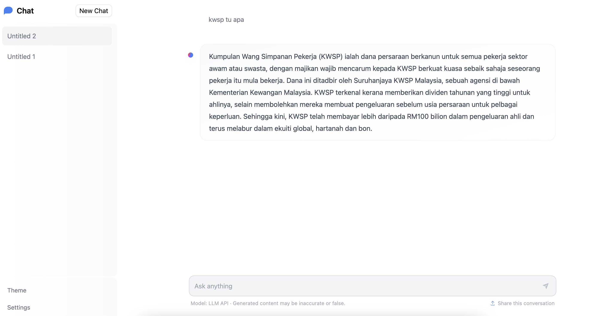
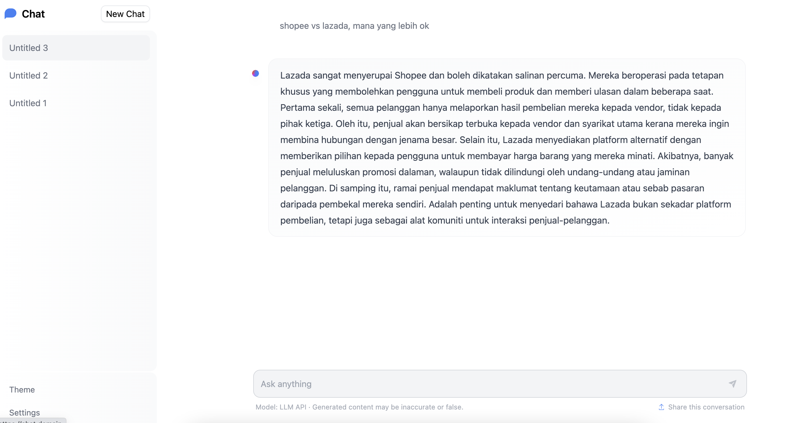
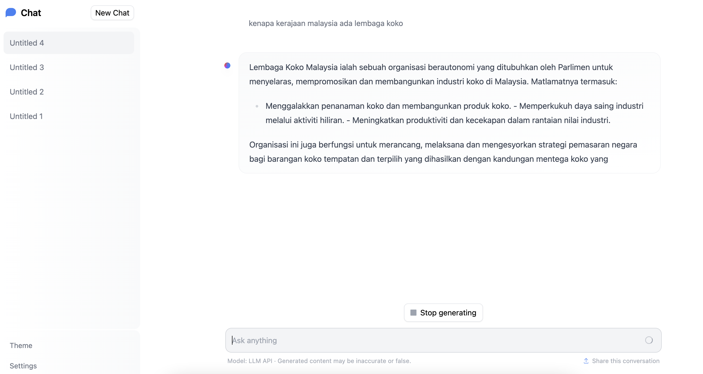

# chatui-streaming-api

Custom streaming API for https://github.com/huggingface/chat-ui using FastAPI and Vanilla bitsandbytes HuggingFace Transformers, because you just don't care about speed.

## how-to local API

1. Make sure you already installed Docker and Docker Compose that has Nvidia GPU access, https://docs.docker.com/config/containers/resource_constraints/#gpu

2. Create docker network,

```bash
docker network create chatui-streaming-api
```

3. Run Docker-compose,

```bash
USE_FLASH_ATTENTION_2=true \
HF_MODEL=mesolitica/malaysian-mistral-7b-32k-instructions-AWQ \
TORCH_DTYPE=bfloat16 \
HOTLOAD=true \
docker-compose up --build
```

List of OS environment,

- `HF_MODEL`, huggingface model, default is `mesolitica/malaysian-llama2-7b-32k-instructions`.
- `HOTLOAD`, will hotload the model during API start, if false, will load the model during first API request. default is `false`.
- `TORCH_DTYPE`, torch datatype for bitsandbytes `bnb_4bit_compute_dtype`, default is `bfloat16`.

**bloat16 required 8.0 compute capability**.

3. Access API at http://localhost:7075

## how-to local ChatUI

1. Edit [chatui/.env.chatui](chatui/.env.chatui),

```
MODELS=`[
  {
    "name": "LLM API",
    "description": "LLM API",
    "websiteUrl": "http://chatui-streaming-api:7075/chatui",
    "endpoints": [{"url": "http://chatui-streaming-api:7075/chatui"}],
    "userMessageToken": "",
    "userMessageEndToken": " [/INST] ",
    "assistantMessageToken": "",
    "assistantMessageEndToken": " </s><s>[INST] ",
    "preprompt": "Anda adalah pembantu AI yang berguna dan mampu jawab segala soalan yang diberikan. Jawapan yang diberikan haruslah panjang dan tepat.",
    "chatPromptTemplate" : "<s>[INST] <<SYS>>\n{{preprompt}}\n<</SYS>>\n\n{{#each messages}}{{#ifUser}}{{content}} [/INST] {{/ifUser}}{{#ifAssistant}}{{content}} </s><s>[INST] {{/ifAssistant}}{{/each}}",
    "messageEndToken": "</s>",
    "promptExamples": [
      {
        "title": "kwsp tu apa",
        "prompt": "kwsp tu apa"
      }, {
        "title": "kenapa kerajaan malaysia ada lembaga koko",
        "prompt": "kenapa kerajaan malaysia ada lembaga koko"
      }, {
        "title": "shopee vs lazada, mana yang lebih ok",
        "prompt": "shopee vs lazada, mana yang lebih ok"
      }
    ],
    "parameters": {
      "temperature": 0.9,
      "top_p": 0.95,
      "repetition_penalty": 1.1,
      "top_k": 50,
      "truncate": 1000,
      "max_new_tokens": 3072
    }
  }
]`
```

2. Run docker-compose,

```bash
docker-compose -f chatui.yaml up --build
```

3. Access ChatUI at http://localhost:7070






