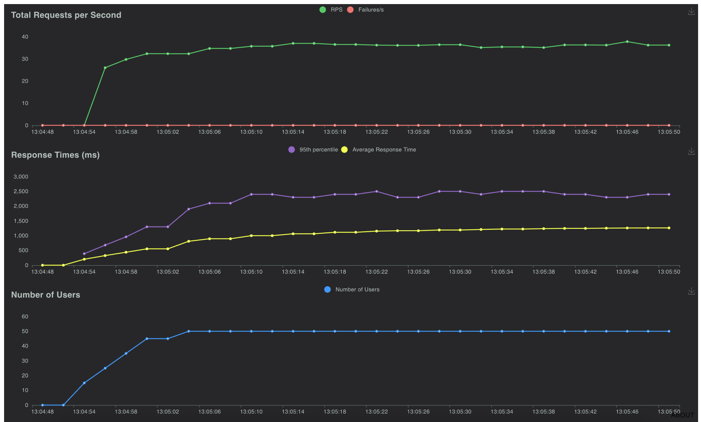
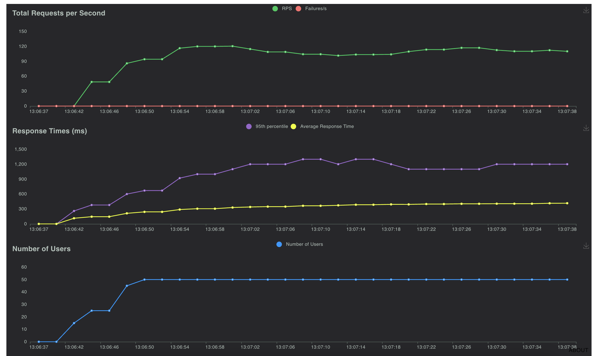
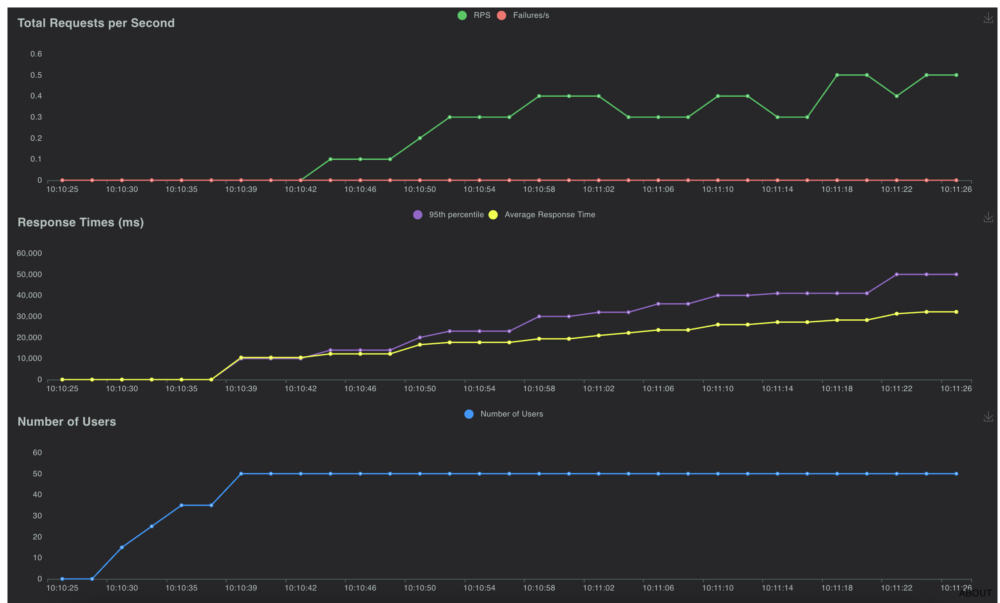
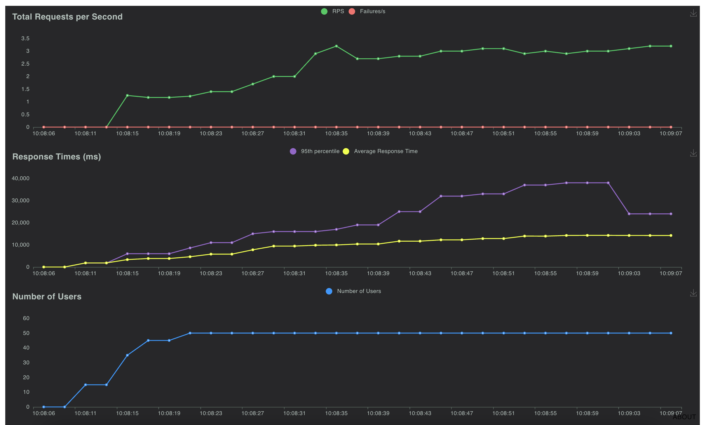
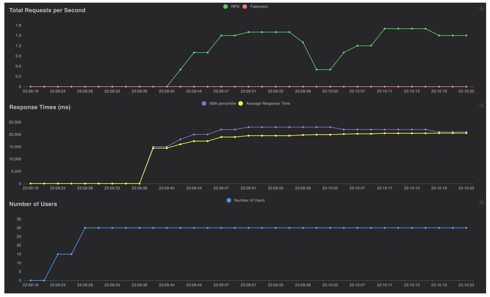
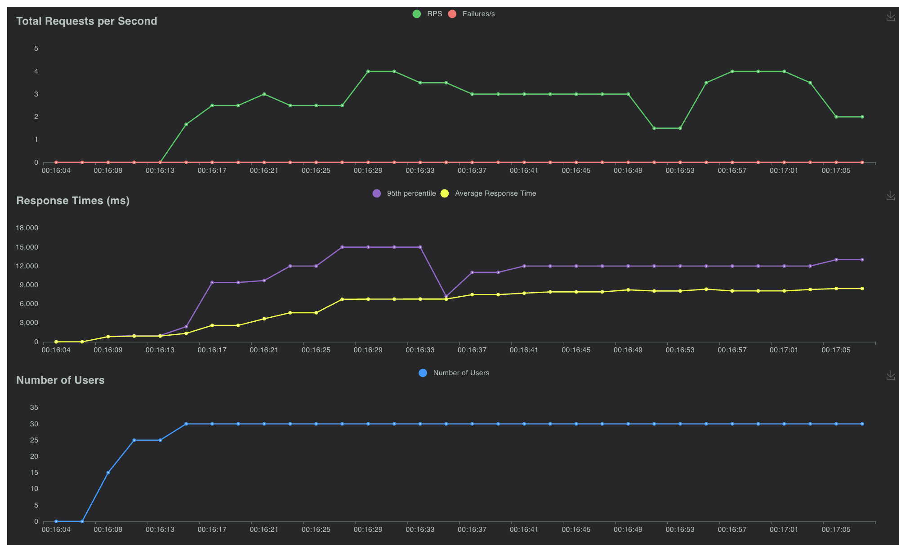

# transformers-openai-api

Lightweight continuous batching OpenAI compatibility using HuggingFace Transformers include T5 and Whisper.

1. Streaming token.
2. Can serve user defined max concurrency.
3. Each request got it's own KV Cache using Transformers Cache.
4. Disconnected signal, so this is to ensure early stop.
5. Properly cleanup KV Cache after each requests.
6. Support Encoder-Decoder like T5.
7. Continuous batching for better throughput, support both Encoder-Decoder and Decoder.
8. Support Audio Transcriptions with streaming token using Whisper.

## how to install

Using PIP with git,

```bash
pip3 install git+https://github.com/mesolitica/transformers-openai-api
```

Or you can git clone,

```bash
git clone https://github.com/mesolitica/transformers-openai-api && cd transformers-openai-api
```

## how to local

### Supported parameters

```bash
python3 -m transformers_openai.main --help
```

```text
usage: main.py [-h] [--host HOST] [--port PORT] [--loglevel LOGLEVEL] [--model-type MODEL_TYPE] [--tokenizer-type TOKENIZER_TYPE]
               [--tokenizer-use-fast TOKENIZER_USE_FAST] [--processor-type PROCESSOR_TYPE] [--hf-model HF_MODEL]
               [--hotload HOTLOAD] [--attn-implementation ATTN_IMPLEMENTATION] [--torch-dtype TORCH_DTYPE]
               [--architecture-type {decoder,encoder-decoder}] [--serving-type {chat,whisper}] [--cache-type CACHE_TYPE]
               [--continuous-batching CONTINUOUS_BATCHING] [--continuous-batching-microsleep CONTINUOUS_BATCHING_MICROSLEEP]
               [--continuous-batching-batch-size CONTINUOUS_BATCHING_BATCH_SIZE] [--accelerator-type ACCELERATOR_TYPE]
               [--max-concurrent MAX_CONCURRENT] [--neuronx-n-positions NEURONX_N_POSITIONS]
               [--neuronx-batch-size NEURONX_BATCH_SIZE]

Configuration parser

optional arguments:
  -h, --help            show this help message and exit
  --host HOST           host name to host the app (default: 0.0.0.0, env: HOSTNAME)
  --port PORT           port to host the app (default: 7088, env: PORT)
  --loglevel LOGLEVEL   Logging level (default: INFO, env: LOGLEVEL)
  --model-type MODEL_TYPE
                        Model type (default: AutoModelForCausalLM, env: MODEL_TYPE)
  --tokenizer-type TOKENIZER_TYPE
                        Tokenizer type (default: AutoTokenizer, env: TOKENIZER_TYPE)
  --tokenizer-use-fast TOKENIZER_USE_FAST
                        Use fast tokenizer (default: True, env: TOKENIZER_USE_FAST)
  --processor-type PROCESSOR_TYPE
                        Processor type (default: AutoTokenizer, env: PROCESSOR_TYPE)
  --hf-model HF_MODEL   Hugging Face model (default: mesolitica/malaysian-llama2-7b-32k-instructions, env: HF_MODEL)
  --hotload HOTLOAD     Enable hot loading (default: True, env: HOTLOAD)
  --attn-implementation ATTN_IMPLEMENTATION
                        Attention implementation (default: sdpa, env: ATTN_IMPLEMENTATION)
  --torch-dtype TORCH_DTYPE
                        Torch data type (default: bfloat16, env: TORCH_DTYPE)
  --architecture-type {decoder,encoder-decoder}
                        Architecture type (default: decoder, env: ARCHITECTURE_TYPE)
  --serving-type {chat,whisper}
                        Serving type (default: chat, env: SERVING_TYPE)
  --cache-type CACHE_TYPE
                        Cache type (default: DynamicCache, env: CACHE_TYPE)
  --continuous-batching CONTINUOUS_BATCHING
                        Enable continuous batching (default: False, env: CONTINUOUS_BATCHING)
  --continuous-batching-microsleep CONTINUOUS_BATCHING_MICROSLEEP
                        microsleep to group continuous batching, 1 / 1e-3 = 1k steps for second (default: 0.0001, env:
                        CONTINUOUS_BATCHING_MICROSLEEP)
  --continuous-batching-batch-size CONTINUOUS_BATCHING_BATCH_SIZE
                        maximum of batch size during continuous batching (default: 20, env: CONTINUOUS_BATCHING_BATCH_SIZE)
  --accelerator-type ACCELERATOR_TYPE
                        Accelerator type (default: cuda, env: ACCELERATOR_TYPE)
  --max-concurrent MAX_CONCURRENT
                        Maximum concurrent requests (default: 100, env: MAX_CONCURRENT)
  --neuronx-n-positions NEURONX_N_POSITIONS
                        NeuronX number of positions (default: 2048, env: N_POSITIONS)
  --neuronx-batch-size NEURONX_BATCH_SIZE
                        NeuronX batch size (default: 1, env: BATCH_SIZE)
```

**We support both args and OS environment**.

### Run Decoder

#### Continuous batching

```
python3 -m transformers_openai.main \
--host 0.0.0.0 --port 7088 --hf-model mesolitica/malaysian-tinyllama-1.1b-16k-instructions-v4 \
--continous-batching true
```

#### Non-continuous batching

```bash
python3 -m transformers_openai.main \
--host 0.0.0.0 --port 7088 --hf-model mesolitica/malaysian-tinyllama-1.1b-16k-instructions-v4
```

#### Example OpenAI library

```python
from openai import OpenAI

client = OpenAI(
    api_key='-',
    base_url = 'http://localhost:7088'
)

messages = [
    {'role': 'user', 'content': "hello"}
]
response = client.chat.completions.create(
    model='model',
    messages=messages,
    temperature=0.1,
    max_tokens=1024,
    top_p=0.95,
    stop=['[/INST]', '[INST]', '<s>'],
)
```

Output,

```
ChatCompletion(id='c8695dd2-5ab8-4064-9bd5-c5d666324aa3', choices=[Choice(finish_reason='stop', index=0, logprobs=None, message=ChatCompletionMessage(content='helo! Bagaimana saya boleh membantu anda hari ini?', role='assistant', function_call=None, tool_calls=None), stop_reason=None)], created=1714235932, model='model', object='chat.completion', system_fingerprint=None, usage=CompletionUsage(completion_tokens=0, prompt_tokens=0, total_tokens=0))
```

Recorded streaming,

https://github.com/mesolitica/transformers-openai-api/assets/19810909/5a8c873b-2a80-4c87-92d8-f50a64bc5adf

### Run Encoder-Decoder

#### Continuous batching

```bash
python3 -m transformers_openai.main \
--host 0.0.0.0 --port 7088 \
--attn-implementation sdpa \
--model-type transformers_openai.models.T5ForConditionalGeneration \
--tokenizer-type AutoTokenizer \
--tokenizer-use-fast false \
--architecture-type encoder-decoder \
--torch-dtype bfloat16 \
--cache-type none \
--continous-batching true \
--hf-model google/flan-t5-base
```

#### Non-continuous batching

```bash
python3 -m transformers_openai.main \
--host 0.0.0.0 --port 7088 \
--attn-implementation sdpa \
--model-type transformers_openai.models.T5ForConditionalGeneration \
--tokenizer-type AutoTokenizer \
--tokenizer-use-fast false \
--architecture-type encoder-decoder \
--torch-dtype bfloat16 \
--cache-type none \
--hf-model google/flan-t5-base
```

#### Example OpenAI library

```python
from openai import OpenAI

client = OpenAI(
    api_key='-',
    base_url = 'http://localhost:7088'
)

messages = [
    {'role': 'user', 'content': "Q: Can Geoffrey Hinton have a conversation with George Washington? Give the rationale before answering.</s>"}
]
response = client.chat.completions.create(
    model='model',
    messages=messages,
    temperature=0.1,
    max_tokens=1024,
    top_p=0.95,
)
response
```

Output,

```
ChatCompletion(id='026bb93b-095f-4bfb-8540-b9b26ce41259', choices=[Choice(finish_reason='stop', index=0, logprobs=None, message=ChatCompletionMessage(content=' Geoffrey Hinton was born in Virginia in 1862. George Washington was born in 1859. The final answer: yes.', role='assistant', function_call=None, tool_calls=None), stop_reason=None)], created=1720149843, model='model', object='chat.completion', system_fingerprint=None, usage=CompletionUsage(completion_tokens=27, prompt_tokens=24, total_tokens=51))
```

Recorded streaming,

https://github.com/mesolitica/transformers-openai-api/assets/19810909/0ec43628-30da-4d99-b483-a5d166bc335c

Output streaming,

```
data: {"id": "20e9d233-6f6c-4dc4-95a9-7dcf077e9b57", "choices": [{"delta": {"content": " George", "function_call": null, "role": null, "tool_calls": null}, "finish_reason": null, "index": 0, "logprobs": null}], "created": 1720157833, "model": "model", "object": "chat.completion.chunk", "system_fingerprint": null}

data: {"id": "20e9d233-6f6c-4dc4-95a9-7dcf077e9b57", "choices": [{"delta": {"content": " Washington", "function_call": null, "role": null, "tool_calls": null}, "finish_reason": null, "index": 0, "logprobs": null}], "created": 1720157833, "model": "model", "object": "chat.completion.chunk", "system_fingerprint": null}

data: {"id": "20e9d233-6f6c-4dc4-95a9-7dcf077e9b57", "choices": [{"delta": {"content": " died", "function_call": null, "role": null, "tool_calls": null}, "finish_reason": null, "index": 0, "logprobs": null}], "created": 1720157833, "model": "model", "object": "chat.completion.chunk", "system_fingerprint": null}

data: {"id": "20e9d233-6f6c-4dc4-95a9-7dcf077e9b57", "choices": [{"delta": {"content": " on", "function_call": null, "role": null, "tool_calls": null}, "finish_reason": null, "index": 0, "logprobs": null}], "created": 1720157833, "model": "model", "object": "chat.completion.chunk", "system_fingerprint": null}

data: {"id": "20e9d233-6f6c-4dc4-95a9-7dcf077e9b57", "choices": [{"delta": {"content": " June", "function_call": null, "role": null, "tool_calls": null}, "finish_reason": null, "index": 0, "logprobs": null}], "created": 1720157833, "model": "model", "object": "chat.completion.chunk", "system_fingerprint": null}

data: {"id": "20e9d233-6f6c-4dc4-95a9-7dcf077e9b57", "choices": [{"delta": {"content": " 6,", "function_call": null, "role": null, "tool_calls": null}, "finish_reason": null, "index": 0, "logprobs": null}], "created": 1720157833, "model": "model", "object": "chat.completion.chunk", "system_fingerprint": null}

data: {"id": "20e9d233-6f6c-4dc4-95a9-7dcf077e9b57", "choices": [{"delta": {"content": " 17", "function_call": null, "role": null, "tool_calls": null}, "finish_reason": null, "index": 0, "logprobs": null}], "created": 1720157833, "model": "model", "object": "chat.completion.chunk", "system_fingerprint": null}

data: {"id": "20e9d233-6f6c-4dc4-95a9-7dcf077e9b57", "choices": [{"delta": {"content": "65", "function_call": null, "role": null, "tool_calls": null}, "finish_reason": null, "index": 0, "logprobs": null}], "created": 1720157833, "model": "model", "object": "chat.completion.chunk", "system_fingerprint": null}

data: {"id": "20e9d233-6f6c-4dc4-95a9-7dcf077e9b57", "choices": [{"delta": {"content": ".", "function_call": null, "role": null, "tool_calls": null}, "finish_reason": null, "index": 0, "logprobs": null}], "created": 1720157833, "model": "model", "object": "chat.completion.chunk", "system_fingerprint": null}

data: {"id": "20e9d233-6f6c-4dc4-95a9-7dcf077e9b57", "choices": [{"delta": {"content": " George", "function_call": null, "role": null, "tool_calls": null}, "finish_reason": null, "index": 0, "logprobs": null}], "created": 1720157833, "model": "model", "object": "chat.completion.chunk", "system_fingerprint": null}

data: {"id": "20e9d233-6f6c-4dc4-95a9-7dcf077e9b57", "choices": [{"delta": {"content": " Washington", "function_call": null, "role": null, "tool_calls": null}, "finish_reason": null, "index": 0, "logprobs": null}], "created": 1720157833, "model": "model", "object": "chat.completion.chunk", "system_fingerprint": null}

data: {"id": "20e9d233-6f6c-4dc4-95a9-7dcf077e9b57", "choices": [{"delta": {"content": " was", "function_call": null, "role": null, "tool_calls": null}, "finish_reason": null, "index": 0, "logprobs": null}], "created": 1720157833, "model": "model", "object": "chat.completion.chunk", "system_fingerprint": null}

data: {"id": "20e9d233-6f6c-4dc4-95a9-7dcf077e9b57", "choices": [{"delta": {"content": " born", "function_call": null, "role": null, "tool_calls": null}, "finish_reason": null, "index": 0, "logprobs": null}], "created": 1720157833, "model": "model", "object": "chat.completion.chunk", "system_fingerprint": null}

data: {"id": "20e9d233-6f6c-4dc4-95a9-7dcf077e9b57", "choices": [{"delta": {"content": " in", "function_call": null, "role": null, "tool_calls": null}, "finish_reason": null, "index": 0, "logprobs": null}], "created": 1720157833, "model": "model", "object": "chat.completion.chunk", "system_fingerprint": null}

data: {"id": "20e9d233-6f6c-4dc4-95a9-7dcf077e9b57", "choices": [{"delta": {"content": " Washington", "function_call": null, "role": null, "tool_calls": null}, "finish_reason": null, "index": 0, "logprobs": null}], "created": 1720157833, "model": "model", "object": "chat.completion.chunk", "system_fingerprint": null}

data: {"id": "20e9d233-6f6c-4dc4-95a9-7dcf077e9b57", "choices": [{"delta": {"content": ",", "function_call": null, "role": null, "tool_calls": null}, "finish_reason": null, "index": 0, "logprobs": null}], "created": 1720157833, "model": "model", "object": "chat.completion.chunk", "system_fingerprint": null}

data: {"id": "20e9d233-6f6c-4dc4-95a9-7dcf077e9b57", "choices": [{"delta": {"content": " D", "function_call": null, "role": null, "tool_calls": null}, "finish_reason": null, "index": 0, "logprobs": null}], "created": 1720157833, "model": "model", "object": "chat.completion.chunk", "system_fingerprint": null}

data: {"id": "20e9d233-6f6c-4dc4-95a9-7dcf077e9b57", "choices": [{"delta": {"content": ".", "function_call": null, "role": null, "tool_calls": null}, "finish_reason": null, "index": 0, "logprobs": null}], "created": 1720157833, "model": "model", "object": "chat.completion.chunk", "system_fingerprint": null}

data: {"id": "20e9d233-6f6c-4dc4-95a9-7dcf077e9b57", "choices": [{"delta": {"content": "C", "function_call": null, "role": null, "tool_calls": null}, "finish_reason": null, "index": 0, "logprobs": null}], "created": 1720157833, "model": "model", "object": "chat.completion.chunk", "system_fingerprint": null}

data: {"id": "20e9d233-6f6c-4dc4-95a9-7dcf077e9b57", "choices": [{"delta": {"content": ".", "function_call": null, "role": null, "tool_calls": null}, "finish_reason": null, "index": 0, "logprobs": null}], "created": 1720157833, "model": "model", "object": "chat.completion.chunk", "system_fingerprint": null}

data: {"id": "20e9d233-6f6c-4dc4-95a9-7dcf077e9b57", "choices": [{"delta": {"content": " So", "function_call": null, "role": null, "tool_calls": null}, "finish_reason": null, "index": 0, "logprobs": null}], "created": 1720157833, "model": "model", "object": "chat.completion.chunk", "system_fingerprint": null}

data: {"id": "20e9d233-6f6c-4dc4-95a9-7dcf077e9b57", "choices": [{"delta": {"content": " the", "function_call": null, "role": null, "tool_calls": null}, "finish_reason": null, "index": 0, "logprobs": null}], "created": 1720157833, "model": "model", "object": "chat.completion.chunk", "system_fingerprint": null}

data: {"id": "20e9d233-6f6c-4dc4-95a9-7dcf077e9b57", "choices": [{"delta": {"content": " final", "function_call": null, "role": null, "tool_calls": null}, "finish_reason": null, "index": 0, "logprobs": null}], "created": 1720157833, "model": "model", "object": "chat.completion.chunk", "system_fingerprint": null}

data: {"id": "20e9d233-6f6c-4dc4-95a9-7dcf077e9b57", "choices": [{"delta": {"content": " answer", "function_call": null, "role": null, "tool_calls": null}, "finish_reason": null, "index": 0, "logprobs": null}], "created": 1720157833, "model": "model", "object": "chat.completion.chunk", "system_fingerprint": null}

data: {"id": "20e9d233-6f6c-4dc4-95a9-7dcf077e9b57", "choices": [{"delta": {"content": " is", "function_call": null, "role": null, "tool_calls": null}, "finish_reason": null, "index": 0, "logprobs": null}], "created": 1720157833, "model": "model", "object": "chat.completion.chunk", "system_fingerprint": null}

data: {"id": "20e9d233-6f6c-4dc4-95a9-7dcf077e9b57", "choices": [{"delta": {"content": " no", "function_call": null, "role": null, "tool_calls": null}, "finish_reason": null, "index": 0, "logprobs": null}], "created": 1720157833, "model": "model", "object": "chat.completion.chunk", "system_fingerprint": null}

data: {"id": "20e9d233-6f6c-4dc4-95a9-7dcf077e9b57", "choices": [{"delta": {"content": ".", "function_call": null, "role": null, "tool_calls": null}, "finish_reason": null, "index": 0, "logprobs": null}], "created": 1720157833, "model": "model", "object": "chat.completion.chunk", "system_fingerprint": null}
```

### Run Whisper

#### Continuous batching

```bash
python3.10 -m transformers_openai.main \
--host 0.0.0.0 --port 7088 \
--attn-implementation sdpa \
--model-type transformers_openai.models.WhisperForConditionalGeneration \
--processor-type AutoProcessor \
--serving-type whisper \
--torch-dtype bfloat16 \
--cache-type none \
--continous-batching true \
--hf-model openai/whisper-large-v3
```

#### Non-continuous batching

```bash
python3 -m transformers_openai.main \
--host 0.0.0.0 --port 7088 \
--attn-implementation sdpa \
--model-type WhisperForConditionalGeneration \
--processor-type AutoProcessor \
--serving-type whisper \
--torch-dtype bfloat16 \
--cache-type none \
--hf-model openai/whisper-large-v3
```

#### Example OpenAI library

```python
from openai import OpenAI

client = OpenAI(
    api_key='-',
    base_url = 'http://localhost:7088'
)

audio_file= open("stress-test/audio/Lex-Fridman-on-Grigori-Perelman-turning-away-1million-and-Fields-Medal.mp3", "rb")
transcription = client.audio.transcriptions.create(
    model="model", 
    file=audio_file,
    response_format="verbose_json"
)
transcription
```

Output,

```
Transcription(text="these photos of him looking very broke, like he could use the money. He turned away the money. He turned away everything. You know, there's, you just have to listen to the inner voice. You have to listen to yourself and make the decisions that don't make any sense for the rest of the world and make sense to you. I mean, Bob Dylan didn't show up to pick up his Nobel Peace Prize. That's punk. Yeah. Yeah. He probably grew in notoriety for that. Maybe he just doesn't like going to Sweden,", task='transcribe', language='en', duration=59.14, segments=[{'id': 0, 'seek': 0, 'start': 30.0, 'end': 33.2, 'text': 'these photos of him looking very broke,', 'tokens': [42678, 5787, 295, 796, 1237, 588, 6902, 11], 'temperature': 0.0, 'avg_logprob': 0.0, 'compression_ratio': 1.0, 'no_speech_prob': 0.0}, {'id': 1, 'seek': 0, 'start': 33.6, 'end': 34.82, 'text': 'like he could use the money.', 'tokens': [4092, 415, 727, 764, 264, 1460, 13], 'temperature': 0.0, 'avg_logprob': 0.0, 'compression_ratio': 1.0, 'no_speech_prob': 0.0}, {'id': 2, 'seek': 0, 'start': 35.28, 'end': 36.6, 'text': 'He turned away the money.', 'tokens': [5205, 3574, 1314, 264, 1460, 13], 'temperature': 0.0, 'avg_logprob': 0.0, 'compression_ratio': 1.0, 'no_speech_prob': 0.0}, {'id': 3, 'seek': 0, 'start': 36.78, 'end': 37.56, 'text': 'He turned away everything.', 'tokens': [5205, 3574, 1314, 1203, 13], 'temperature': 0.0, 'avg_logprob': 0.0, 'compression_ratio': 1.0, 'no_speech_prob': 0.0}, {'id': 4, 'seek': 0, 'start': 38.46, 'end': 41.54, 'text': "You know, there's, you just have to listen", 'tokens': [3223, 458, 11, 456, 311, 11, 291, 445, 362, 281, 2140], 'temperature': 0.0, 'avg_logprob': 0.0, 'compression_ratio': 1.0, 'no_speech_prob': 0.0}, {'id': 5, 'seek': 0, 'start': 41.54, 'end': 42.22, 'text': 'to the inner voice.', 'tokens': [1353, 264, 7284, 3177, 13], 'temperature': 0.0, 'avg_logprob': 0.0, 'compression_ratio': 1.0, 'no_speech_prob': 0.0}, {'id': 6, 'seek': 0, 'start': 42.32, 'end': 44.019999999999996, 'text': 'You have to listen to yourself and make the decisions', 'tokens': [3223, 362, 281, 2140, 281, 1803, 293, 652, 264, 5327], 'temperature': 0.0, 'avg_logprob': 0.0, 'compression_ratio': 1.0, 'no_speech_prob': 0.0}, {'id': 7, 'seek': 0, 'start': 44.019999999999996, 'end': 46.120000000000005, 'text': "that don't make any sense for the rest of the world", 'tokens': [6780, 500, 380, 652, 604, 2020, 337, 264, 1472, 295, 264, 1002], 'temperature': 0.0, 'avg_logprob': 0.0, 'compression_ratio': 1.0, 'no_speech_prob': 0.0}, {'id': 8, 'seek': 0, 'start': 46.120000000000005, 'end': 47.620000000000005, 'text': 'and make sense to you.', 'tokens': [474, 652, 2020, 281, 291, 13], 'temperature': 0.0, 'avg_logprob': 0.0, 'compression_ratio': 1.0, 'no_speech_prob': 0.0}, {'id': 9, 'seek': 0, 'start': 47.96, 'end': 49.480000000000004, 'text': "I mean, Bob Dylan didn't show up to pick up", 'tokens': [40, 914, 11, 6085, 28160, 994, 380, 855, 493, 281, 1888, 493], 'temperature': 0.0, 'avg_logprob': 0.0, 'compression_ratio': 1.0, 'no_speech_prob': 0.0}, {'id': 10, 'seek': 0, 'start': 49.480000000000004, 'end': 50.44, 'text': 'his Nobel Peace Prize.', 'tokens': [18300, 24611, 13204, 22604, 13], 'temperature': 0.0, 'avg_logprob': 0.0, 'compression_ratio': 1.0, 'no_speech_prob': 0.0}, {'id': 11, 'seek': 0, 'start': 50.68, 'end': 51.28, 'text': "That's punk.", 'tokens': [6390, 311, 25188, 13], 'temperature': 0.0, 'avg_logprob': 0.0, 'compression_ratio': 1.0, 'no_speech_prob': 0.0}, {'id': 12, 'seek': 0, 'start': 51.5, 'end': 51.72, 'text': 'Yeah.', 'tokens': [5973, 13], 'temperature': 0.0, 'avg_logprob': 0.0, 'compression_ratio': 1.0, 'no_speech_prob': 0.0}, {'id': 13, 'seek': 0, 'start': 52.1, 'end': 52.36, 'text': 'Yeah.', 'tokens': [5973, 13], 'temperature': 0.0, 'avg_logprob': 0.0, 'compression_ratio': 1.0, 'no_speech_prob': 0.0}, {'id': 14, 'seek': 0, 'start': 52.36, 'end': 56.22, 'text': 'He probably grew in notoriety for that.', 'tokens': [5205, 1391, 6109, 294, 46772, 4014, 337, 300, 13], 'temperature': 0.0, 'avg_logprob': 0.0, 'compression_ratio': 1.0, 'no_speech_prob': 0.0}, {'id': 15, 'seek': 0, 'start': 57.04, 'end': 59.14, 'text': "Maybe he just doesn't like going to Sweden,", 'tokens': [29727, 415, 445, 1177, 380, 411, 516, 281, 17727, 11], 'temperature': 0.0, 'avg_logprob': 0.0, 'compression_ratio': 1.0, 'no_speech_prob': 0.0}])
```

We also added extra metrics for Whisper, Seconds per Second,

```text
INFO:root:Complete 62656397-804d-4865-9e5f-8847ff821723, time first token 0.11367368698120117 seconds, time taken 2.6682631969451904 seconds, TPS 132.6705702815537, Seconds Per Second 36.549547515272074
```

Means, in one second, it can processed 36 seconds of audio.

#### Example streaming

OpenAI client does not support streaming, so you must use requests library with streaming, example use cURL,

```python
curl -X 'POST' 'http://localhost:7088/audio/transcriptions' \
-H 'accept: application/json' \
-H 'Content-Type: multipart/form-data' \
-F 'file=@stress-test/audio/Lex-Fridman-on-Grigori-Perelman-turning-away-1million-and-Fields-Medal.mp3;type=audio/mpeg' \
-F 'model=whisper' \
-F 'response_format=srt' \
-F 'stream=true'
```

https://github.com/user-attachments/assets/f73138ce-fddc-4441-b278-7b20e0b9b078

## How to simulate disconnected?

Simple,

```python
import aiohttp
import asyncio
import json
import time

url = 'http://localhost:7088/chat/completions'
headers = {
    'accept': 'application/json',
    'Content-Type': 'application/json'
}
payload = {
    "model": "model",
    "temperature": 1.0,
    "top_p": 0.95,
    "top_k": 50,
    "max_tokens": 256,
    "truncate": 2048,
    "repetition_penalty": 1,
    "stop": [],
    "messages": [
        {
            "role": "user",
            "content": "hello, what is good about malaysia"
        }
    ],
    "stream": True
}

count = 0

async with aiohttp.ClientSession() as session:
    async with session.post(url, headers=headers, json=payload) as response:
        async for line in response.content:
            
            if count > 3:
                break
                
            count += 1
```

You should see warning logs,

```
INFO:root:Received request ae6af2a2-c1a3-4e5f-a9cf-eb1cf645870e in queue 1.9073486328125e-06
INFO:     127.0.0.1:60416 - "POST /chat/completions HTTP/1.1" 200 OK
WARNING:root:
WARNING:root:Cancelling ae6af2a2-c1a3-4e5f-a9cf-eb1cf645870e due to disconnect
```

## [Stress test](stress-test)

### FlanT5 Base

Rate of 5 users per second, total requests up to 50 users for 30 seconds on shared RTX 3090 Ti,

#### Non-continuous batch



#### Continuous batch



### Mistral 7B GPTQ

Rate of 5 users per second, total requests up to 50 users for 60 seconds on shared RTX 3090 Ti,

#### Non-continuous batch



#### Continuous batch



### Whisper Large V3

Rate of 5 users per second, total requests up to 30 users for 60 seconds on shared RTX 3090 Ti,

#### Non-continuous batch



#### Continuous batch


