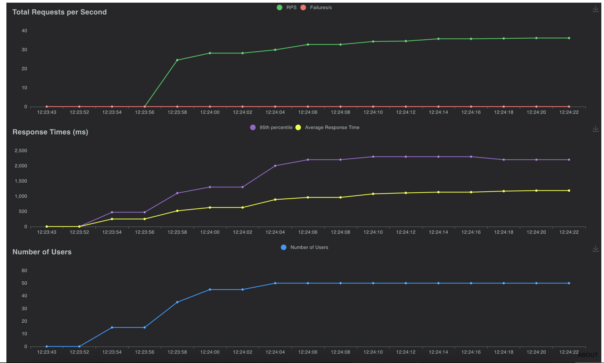
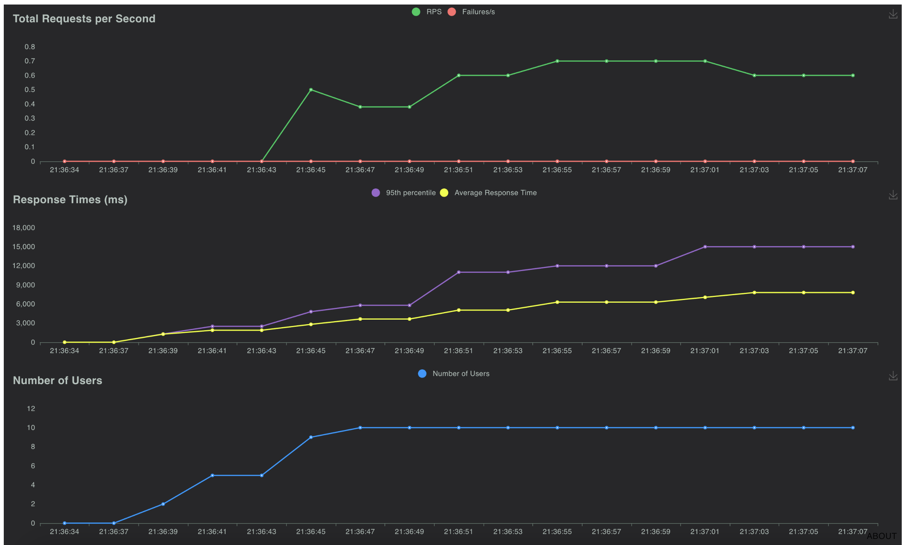
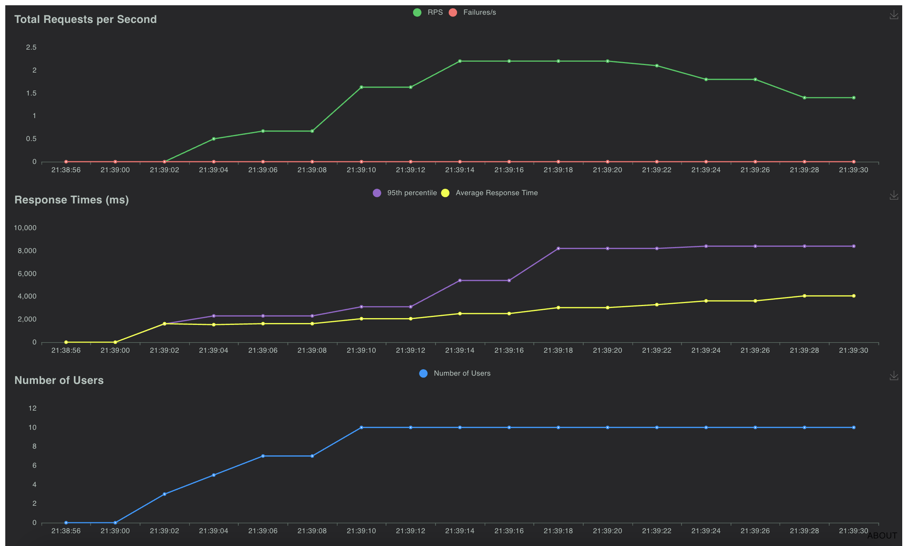

# Stress test

## T5 on RTX 3090 Ti

Rate of 5 users per second, total requests up to 50 users for 30 seconds,

```bash
locust -f t5.py -P 7001 -H http://localhost:7088 -r 5 -u 50 -t 30
```



Full report at [report-t5.html](report-t5.html).

## Mistral 7b GPTQ on RTX 3090 Ti

Rate of 5 users per second, total requests up to 50 users for 30 seconds,

```bash
locust -f mistral_7b_gtpq_continous.py -P 7001 -H http://localhost:7088 -r 1 -u 10 -t 30
locust -f mistral_7b_gtpq_without_continous.py -P 7001 -H http://localhost:7088 -r 1 -u 10 -t 30
```

### Non-continous batch



### Continous batch

