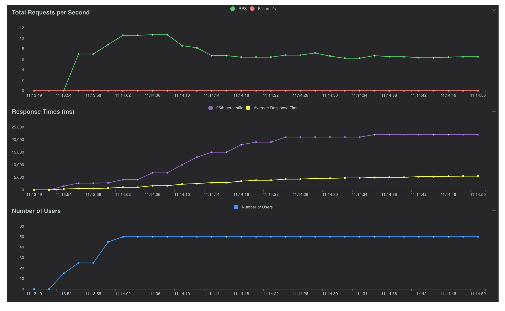

# Stress test

## T5 on RTX 3090

Rate of 5 users per second, total requests up to 50 users for 60 seconds,

```bash
locust -f t5.py -P 7001 -H http://localhost:7088 -r 5 -u 50 -t 60
```


## Llama 3.2 1B Instruct on RTX 3090

Rate of 5 users per second, total requests up to 50 users for 60 seconds,

```bash
locust -f mistral_7b_gtpq.py -P 7001 -H http://localhost:7088 -r 5 -u 50 -t 60
```



## Whisper Large V3 on RTX 3090

Rate of 5 users per second, total requests up to 30 users for 60 seconds,

```bash
locust -f whisper.py -P 7001 -H http://localhost:7088 -r 5 -u 30 -t 60
```

